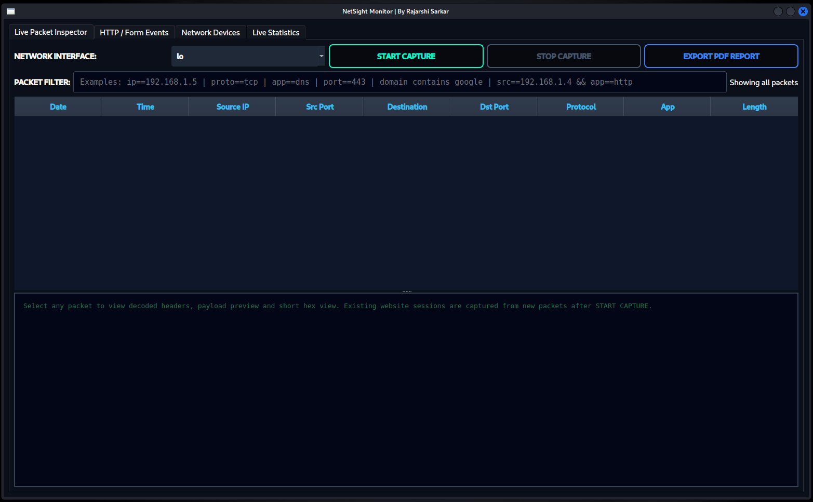
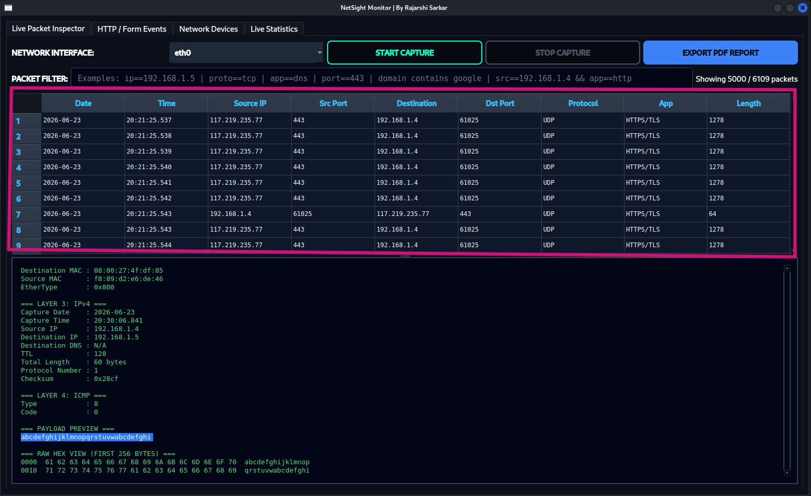
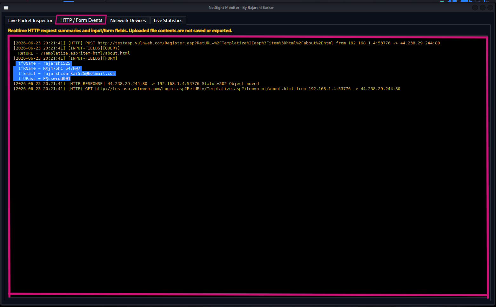
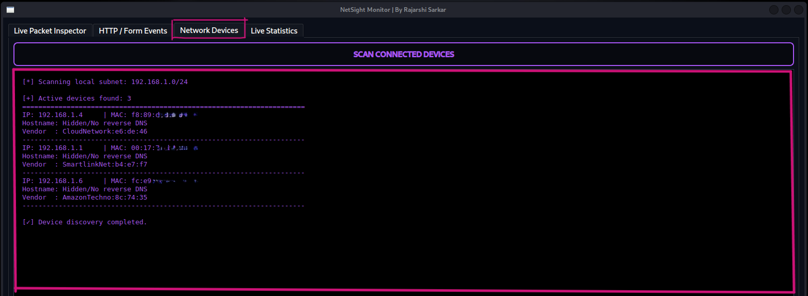
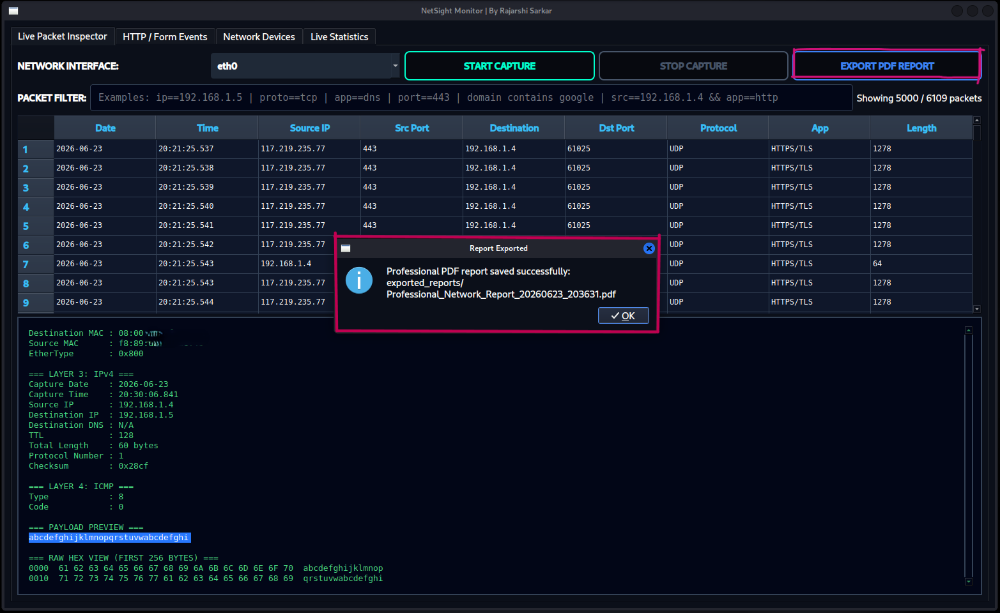

# 🌐 NetSight Monitor

## A Real-Time Network Monitoring and Traffic Analysis Tool

**NetSight Monitor** is a Python-based real-time network monitoring and traffic analysis tool developed as a final-year B.Tech Computer Science & Engineering project.

Developed by **Rajarshi Sarkar**

---

## 📌 Project Overview

**NetSight Monitor** is a real-time network monitoring and traffic analysis tool built using Python. It provides a graphical dashboard for capturing live network packets, identifying network and application protocols, monitoring visible plaintext HTTP/Form events, discovering connected devices, viewing live traffic statistics, applying packet filters, and generating professional PDF reports.

The project is designed for academic learning, authorized lab testing, network visibility, and cybersecurity awareness. It helps users understand how devices communicate inside a network and how packet metadata can be analyzed in a structured and readable format.

> ⚠️ **Important:** This tool is intended only for authorized monitoring, academic demonstration, and controlled lab environments. Do not use it on networks or systems without permission.

---

## ✨ Key Features

- Real-time packet capture from selected network interface
- PyQt6-based graphical desktop dashboard
- Live packet table with date, time, source IP, destination IP, ports, protocol, application protocol, and packet length
- Detailed packet inspection panel
- Payload preview and raw hexadecimal view
- Protocol detection using packet layers and well-known port mapping
- Plaintext HTTP/Form event monitoring in authorized environments
- Connected device discovery using ARP scanning
- Live statistics dashboard
- Packet filtering by IP, protocol, application, port, and domain
- Professional PDF report generation
- Ethical-use documentation for academic and responsible publishing

---

## 🖥️ Interface Overview

NetSight Monitor provides a clean graphical interface divided into multiple working sections.

| Section | Purpose |
|---|---|
| **Live Packet Inspector** | Captures and displays live packet metadata in a structured table format. |
| **HTTP / Form Events** | Shows visible plaintext HTTP request and form events during authorized testing. |
| **Network Devices** | Discovers active local network devices using ARP scanning. |
| **Live Statistics** | Displays total packets, protocol counts, application counts, HTTP/Form events, and top sources. |
| **Packet Filter** | Allows filtering packets by IP, protocol, application, port, and domain. |
| **Export PDF Report** | Generates a professional PDF report from the captured monitoring session. |

---

## 🧱 Technology Stack

| Component | Technology Used |
|---|---|
| Programming Language | Python 3.x |
| GUI Framework | PyQt6 |
| Packet Capture and Analysis | Scapy |
| PDF Report Generation | FPDF / fpdf2 |
| Network Utilities | socket, ipaddress, urllib, re |
| Data Counting | collections.Counter |
| Background Processing | QThread / threading |
| Report Format | PDF |

---

## 📸 Screenshots and Interface Preview

The following screenshots show the major working sections of **NetSight Monitor**. These images demonstrate the graphical dashboard, packet capture process, HTTP/Form event monitoring, connected device discovery, live statistics, and PDF report export feature.

---

### 🖥️ Main Dashboard

The main dashboard provides the primary working area of NetSight Monitor. From this interface, the user can select a network interface, start or stop packet capture, apply packet filters, inspect captured packets, and export a PDF report. The dashboard is divided into different tabs such as **Live Packet Inspector**, **HTTP / Form Events**, **Network Devices**, and **Live Statistics**.

---

### 📡 Packet Capture During Testing

This screenshot shows live packet capture running on the selected network interface. Captured packets are displayed in a structured table with details such as date, time, source IP, source port, destination IP, destination port, protocol, application protocol, and packet length. The lower panel shows decoded packet information, payload preview, and raw hexadecimal data for the selected packet.

---

### 🌐 HTTP / Form Events

The HTTP / Form Events tab displays visible plaintext HTTP activity captured during authorized testing. It shows HTTP requests, responses, query fields, and submitted form fields when such traffic is available in plaintext. This feature is useful for demonstrating the security risk of unencrypted HTTP communication.

> Note: Before publishing screenshots publicly, real credentials, email addresses, private IP addresses, and sensitive values should be blurred or replaced with demo data.

---

### 🧩 Connected Device Discovery

This screenshot shows the Network Devices tab, where NetSight Monitor performs ARP-based device discovery on the local subnet. The tool displays active devices with IP address, MAC address, hostname, and vendor information wherever available. This helps users identify devices connected to the monitored network.

---

### 📊 Live Statistics

The Live Statistics tab provides a quick summary of the capture session. It displays total captured packets, connected devices discovered, protocol totals, application protocol totals, HTTP/Form event counts, and top source IP addresses. This section helps users understand network activity without manually checking every packet.

---

### 📄 PDF Report Export

This screenshot shows the PDF report export feature. After packet capture, the user can click **EXPORT PDF REPORT** to generate a professional report. The report is automatically saved inside the `exported_reports/` folder with a timestamped filename. The PDF includes traffic summary, protocol statistics, device details, HTTP/Form events, packet flow, and interpretation.
